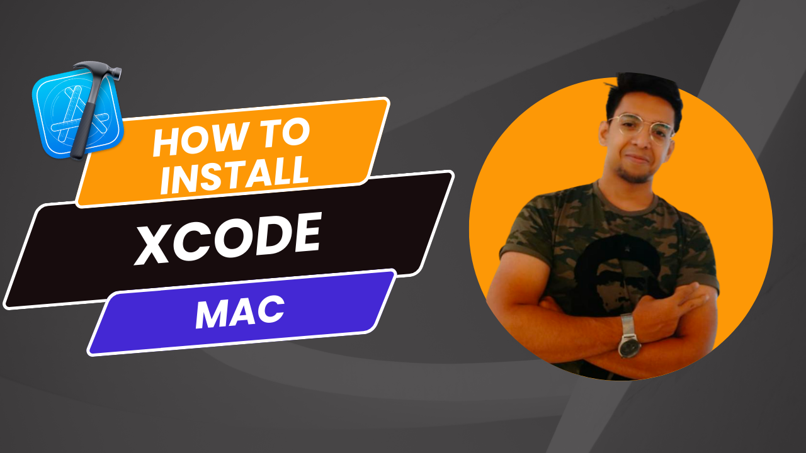
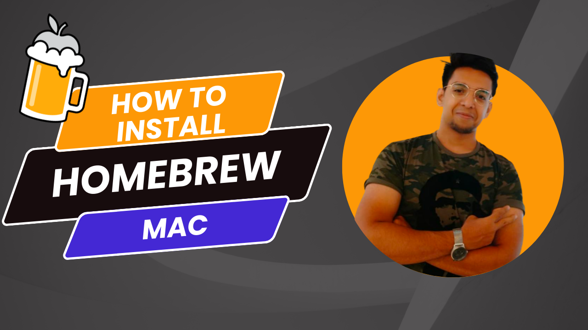

# HowTo
HowTo repository will contain installation and setups for different application / programs etc. 

## Applications

### Mac Only

1. Xcode : https://github.com/atquil/HowTo/tree/Xcode
   

2. Homebrew (Package manager) :

    
3. Terminal (iTerm2 + oh my zsh + powerlevel10k) : 
       - https://github.com/romkatv/powerlevel10k#manual 
       - https://dev.to/abdfnx/oh-my-zsh-powerlevel10k-cool-terminal-1no0 
       - https://gist.github.com/kevin-smets/8568070 

 

### Windows Only

1. Chocolatey (Package manager) :` https://chocolatey.org/install` 
2. Terminal (PoserShell + Oh My Posh ) : `https://docs.microsoft.com/en-us/windows/terminal/tutorials/custom-prompt-setup `

### Mac and Windows

 1. Android Studio : `https://developer.android.com/studio` 
 2. Visual Studio Code : `https://code.visualstudio.com/ `
 3. Java : 
 4. Maven and Gradle :
 5. Dart : `brew install dart`

   
 6. Flutter : 
 7. MySQL + MySql Workbench : `https://www.simplilearn.com/tutorials/mysql-tutorial/mysql-workbench-installation `
 8. GIT | GitHub :  
 9.  OBS (OpenSource for Recording and Streaming) : `https://obsproject.com/ `