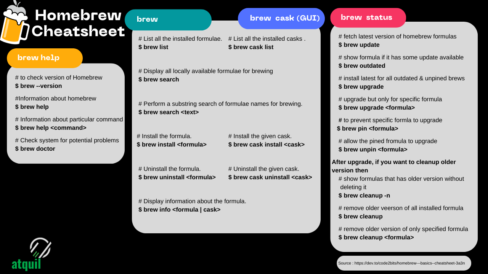

# HomeBrew for Mac 
It's a package manager, making our life easier for managing installing applications.  
<br>

#### We need to install XCODE (https://github.com/atquil/HowTo/tree/Xcode) before homebrew. 

<br>

## Homebrew Installation steps: 
[](https://www.youtube.com/watch?v=S9mjz4P8_ZQ&ab_channel=atquil)

## Steps

1. Open terminal
2. If xcode is not installed then install it 
   ```
   xcode-select --install
   ```
 
3. Paste 
   ```
   /bin/bash -c "$(curl -fsSL https://raw.githubusercontent.com/Homebrew/install/HEAD/install.sh)"
    ```
4. Accept license 
5. Check if installed or not 
```
    brew doctor
``` 
## CheatSheet


## Windows Alternative : Chocolatey