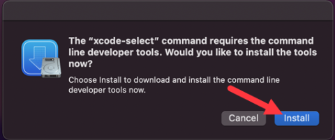
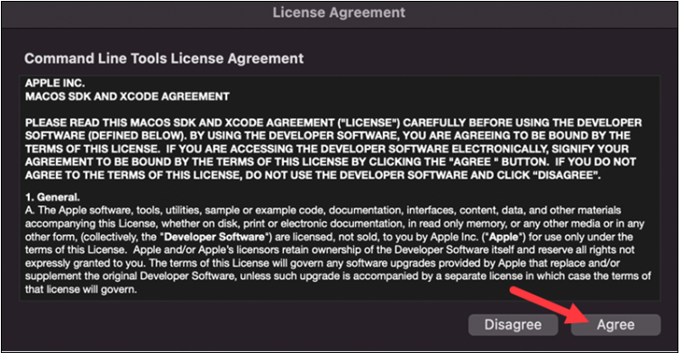
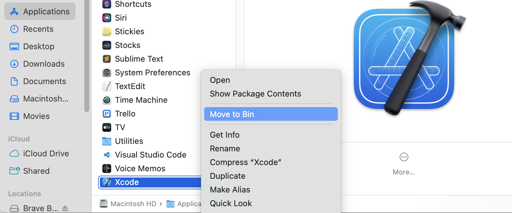

  

# Namestey !! 
# HowTo Install Xcode (YoutubeLink : )

## What is Xcode ? 
Apple's integrated development environment for macOS, used to develop software for macOS, iOS, iPadOS, watchOS, and tvOS. 

## Three Methods to install Xcode : 
## First Method [Fastest]

- Go to this url and download the file : https://developer.apple.com/download/all/ 
- Unzip the file
- Move the Xcode to Application Folder

## Second Method

- Go to **terminal** and type this. 

```
xcode-select --install

```
- Click on **Install** 



- Click on **Accept for License**



## Third Method 

- Go to the AppStore and Type Xcode 
- Click on Get and then Install


# HowTo Uninstall Xcode

### Why to uninstall ? Xcode can take a toll on the store and performance, if memory space is running low. The best way to fix the issue to speed up the mac , is reinstall it from scratch. 

### When to uninstall ?
    - Xcode fails to compile the app / simulators constantly
    - Selling or gifting the Mac to other person 


## Steps : 

1. Move Xcode to Trash and clean the Trash bin

 


2. Go to the Location and delete it

`~/Library/Developer/ `

3. In terminal do hard uninstall 

```
sudo /Developer/Library/uninstall-devtools --mode=all

```

1. Remove the Xcode Application caches if it exist

`~/Library/Caches/com.apple.dt.Xcode`


